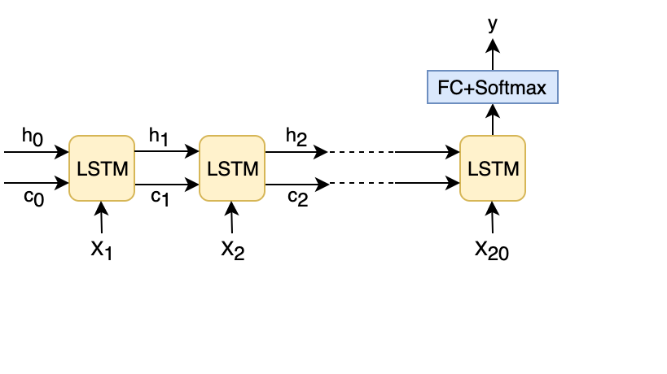
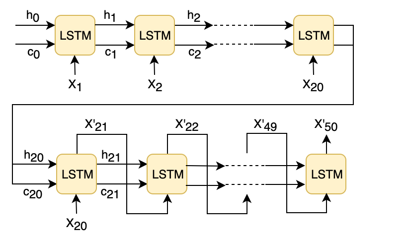
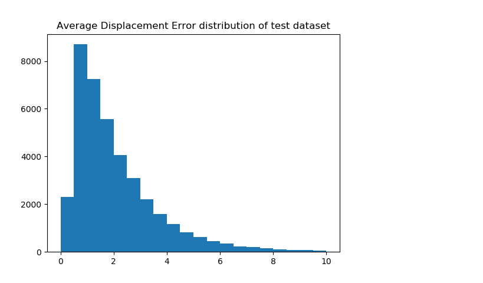
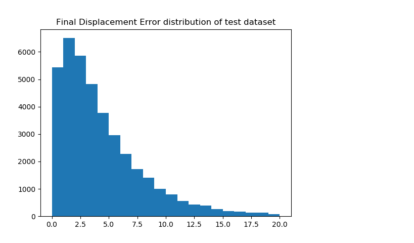

# Vehicle Trajectory Prediction with LSTM Maneuver Classifier
> This is a course project from CMU 24-787 Machine Learning and Artifical Intelligence for Engineering

## About
This project proposes an LSTM encoder-decoder vehicle trajectory predictor assisted by an LSTM maneuver classifier. The classifier differentiates the behaviors of going straight and turning so that the correct centerline
of lane can be chosen for the trajectory predictor. The predictor then predicts the concrete future positions with respect to the centerline. This project uses 2 seconds for observation and 3 seconds for prediction.
The testing gives an average distance error of 2.19m and a final distance error of 4.66 m.

## Table of Contents
* [Overview](#overview)
* [Approach](#approach)
* [Installation](#installation)
* [Usage](#usage)

## Overview
The two major types of trajectory predictions of vehicles are maneuver prediction and trajectory prediction, which are classification problem and regression problem respectively. Maneuver prediction is easier to train and evaluate, but the information provided are vague. Trajectory prediction can provide the positions directly, but it is likely to average the multiple possibilities, which leads to the minimum regression error. Thus, it would be useful if the two methods are combined together.

[Argoverse](https://www.argoverse.org/) is a vehicle trajectory dataset with rich map
information. It contains a series of trajectory points for 5 seconds with 10 Hz data rate. This project uses 2 seconds for observation and 3 seconds for prediction. Argo AI provides [Argoverse API](https://github.com/argoai/argoverse-api) for easy interaction. The API provides a function to extract candidate centerlines of lanes around the trajectories. It also provides a function to choose the most likely centerline by considering the distance along the centerlines and the maximum offset from the centerlines.

## Approach

### LSTM Maneuver Classifier
The classifier is trained to differentiate the behaviors of going straight and turning using 2 seconds of trajectories. 8 features in total are used as inputs, including relative positions of the agent, relative rotation angles and accumulative angle histograms.

<p align="center">
    
</p>

### LSTM Encoder-Decoder Trajectory Predictor
Given a certain centerline, the trajectory
points of the agent in the real world coordinate are converted to the centerline coordinate and then used as inputs. Other input features include rotation angles of the agent and information for the vehicles surrounding the agent. The decoder outputs the future positions in sequence in the centerline coordinate.

<p align="center">
    
</p>

### Results
We used 205,942 trajectories as train set and 39,475 trajectories as test set. For the test set, the average distance error (ADE) is 2.191 m and the final distance error (FDE) of 4.661 m. The distributions of the two errors are shown below.

<p align="center">
    
</p>
<p align="center">
    
</p>


## Installation
Install [Pytorch](https://pytorch.org/). The code has been tested with Python 3.7, Pytorch 1.4, CUDA 10.1 on Ubuntu 18.04. [Argoverse API](https://github.com/argoai/argoverse-api) is also required to calculate features from the raw data.

* Use pip to install required Python packages

    ```
    pip install -r requirements.txt
    ```

* Dataset can be downloaded from [Dataset](https://www.argoverse.org/data.html)

## Usage
* Start training manuver classifier by
    ```
    python manuver_classfication/lstm_classification.py 
    ```
* Start training trajectory predictor by
    ```
    python motion_forecasting/lstm_classification.py 
    ```

## Reference
https://github.com/jagjeet-singh/argoverse-forecasting
